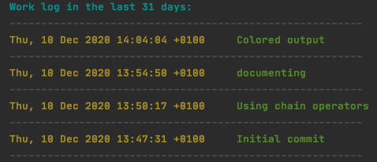

## What Did I Do

---

A Simple CLI for printing a report of your work within a repository.

Sample usage:

```
wdid -t=12
or
wdid -timeframe=12
```
gives you a report of your last 12 days.

Example output:


